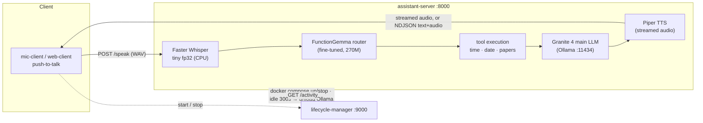

# Local AI Assistant — Server

**A voice assistant that runs entirely on your own machine. Speak to it, it speaks back — no
cloud, no API keys, no data leaving the box.** You hold a key to talk; it transcribes your speech,
decides whether to call a tool, generates a reply, and streams the spoken answer back.

**Entirely manually coded — without AI coding agents.** Apache-2.0.

This is the brain of the system. Two companion repos provide the microphone clients
([mic-client](https://github.com/mattdwall100/mic-client)) and the on-demand start/stop control
plane ([server-lifecycle-manager](https://github.com/mattdwall100/server-lifecycle-manager)). The
tool-routing model is my own fine-tune —
[FunctionGemma-Finetune](https://github.com/mattdwall100/FunctionGemma-Finetune).

## Architecture



A `/speak` request flows: **audio → STT → router LLM (which tools?) → tool execution → main LLM
(streamed) → TTS → streamed audio back.** Every stage has a fallback so a failure degrades to a
spoken apology instead of a crash.

## Headline numbers

Measured on **CPU only (no GPU)** via [`scripts/benchmark.py`](scripts/benchmark.py), which drives
the real pipeline end-to-end (Piper speaks a fixed prompt, fed back through the whole stack), n=15
after 3 warmups. Utterance: *"what time is it"* (exercises STT + routing + a tool call + LLM + TTS).

| Metric | p50 | p95 |
| --- | ---: | ---: |
| **Time to first audio** (request → first spoken chunk ready) | **~3.6 s** | ~4.7 s |
| Speech-to-text (Faster Whisper tiny) | ~1.7 s | ~1.8 s |
| Router LLM decision (FunctionGemma) | ~2.0 s | ~2.9 s |
| **TTFT** — first main-LLM token | **~0.5 s** | ~0.5 s |
| Full spoken reply generated (whole utterance) | ~17 s | ~34 s |

| Resource | Measured |
| --- | --- |
| **Total RAM to serve** | **~3.2 GB** (352 MB pipeline process + ~2.8 GB Ollama models) |
| Models on disk | STT 144 MB · TTS 60 MB · router ~325 MB · main LLM (Granite 4) ~2.1 GB |
| GPU | **None required** — runs 100% on CPU. Optional CUDA image in `misc/`. |
| Test coverage | **85%** across 39 tests (`pytest --cov`) |

The whole voice assistant — STT, a fine-tuned router, a multi-billion-parameter LLM, and neural
TTS — fits in **~3.2 GB of RAM on a CPU-only machine**. Numbers regenerate with
`.\.venv\Scripts\python.exe scripts\benchmark.py` → [`benchmarks/results.json`](benchmarks).

## The router is a model I trained

Tool routing isn't done with hand-written `if` statements or an off-the-shelf model. It's a
**FunctionGemma-270m fine-tune I trained myself**, which took tool-call accuracy from **63.5% →
99.5%**, then merged, converted to GGUF, and published to the Hugging Face Hub — and it now runs
here as the router via Ollama. It reads the user utterance plus the available tool schemas and
decides which tool to call, or to call none and just reply. Full training pipeline and dataset
write-up: [FunctionGemma-Finetune](https://github.com/mattdwall100/FunctionGemma-Finetune).

## Models

| Role | Model | Notes |
| --- | --- | --- |
| Speech-to-text | Faster Whisper **tiny**, fp32, English | CPU by default |
| Tool router | **Fine-tuned FunctionGemma-270m** (GGUF) | via Ollama; see repo above |
| Main LLM | IBM **Granite 4** (also Qwen2.5-1.5B) | via Ollama, custom "Alfred" persona |
| Text-to-speech | **Piper** `en_GB-alan-medium` (ONNX) | streamed audio out |

## API

`GET /health` · `GET /activity` (idle tracking) · `POST /chat` (text) ·
`POST /transcribe` (WAV → text) · `POST /synthesize` (text → audio) ·
`POST /speak` (WAV → full pipeline audio).

**`/speak` streams two ways.** By default it returns raw audio. With
`Accept: application/x-ndjson` (or `?format=multiplex`) it returns an **NDJSON stream that
interleaves `text` and `audio` frames per sentence**, so a client can render the transcript in
lockstep with speech. The transcript and any tool calls also ride in the `X-Transcript` and
`X-Tool-Calls` response headers.

## Running locally

Requires [Ollama](https://ollama.com) running with the models pulled (main LLM + the FunctionGemma
router). Python 3.11–3.13.

```powershell
.\scripts\bootstrap.ps1      # create .venv, install deps
.\scripts\run_server.ps1     # serves on 0.0.0.0:8000
```

Docker (`docker-compose.yml`) and a CUDA variant (`misc/`) are also provided.

## Testing

```powershell
.\.venv\Scripts\python.exe -m pytest
```

39 tests, **85% coverage**. STT/LLM/TTS are mocked (`tests/mocks.py`), so most API and
orchestration behavior is testable without starting Ollama, Whisper, or Piper.

## Design notes

- **Dependency injection** via `create_app(service_factory=...)`, which is what lets the tests swap
  real model clients for mocks.
- **Two-stage LLM:** a lightweight router decides tool calls; the main LLM streams the reply,
  which is sentence-buffered before being handed to TTS so speech starts as early as possible.
- **Fault tolerant:** STT/LLM/TTS failures fall back to generated or prerecorded audio rather than
  erroring the request.
- **Observability:** every stage is wrapped in a `log_latency` context manager
  (`utils/latency_logger.py`) — the same instrumentation the benchmark reads.
- **Layered structure:** `api/` · `orchestrator/` · `services/{stt,llm,tts}` · `tools/` ·
  `memory/` · `rag/` (retrieval extension point) · `core/` config & logging.

## Repository structure

```text
src/assistant_server/
├── main.py                 # FastAPI app factory + Uvicorn entrypoint
├── dependencies.py         # service construction / DI wiring
├── api/                    # HTTP endpoints + request/response schemas
├── orchestrator/           # pipeline.py (STT→router→tools→LLM→TTS), fallback, state
├── services/               # llm/ (Ollama), stt/ (Faster Whisper), tts/ (Piper)
├── tools/                  # tool registry + implementations (time, papers)
├── memory/                 # session memory + paper state
├── rag/                    # retriever extension point (not yet implemented)
└── utils/                  # latency logging, NDJSON streaming
scripts/benchmark.py        # end-to-end latency + memory benchmark
tests/                      # Unit/ + Integration/, mock model clients
```

## Current notes

- RAG is a clean extension point (`rag/retriever.py`), retrieval not yet implemented.
- Wake-word and Raspberry Pi support live in the client roadmap, not this server; input is
  push-to-talk (no VAD).
- Some deployment assets (systemd, CUDA) are drafts — review before production use.
